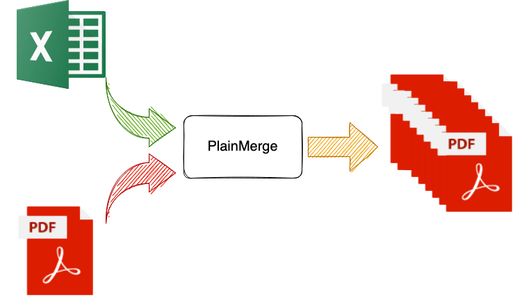
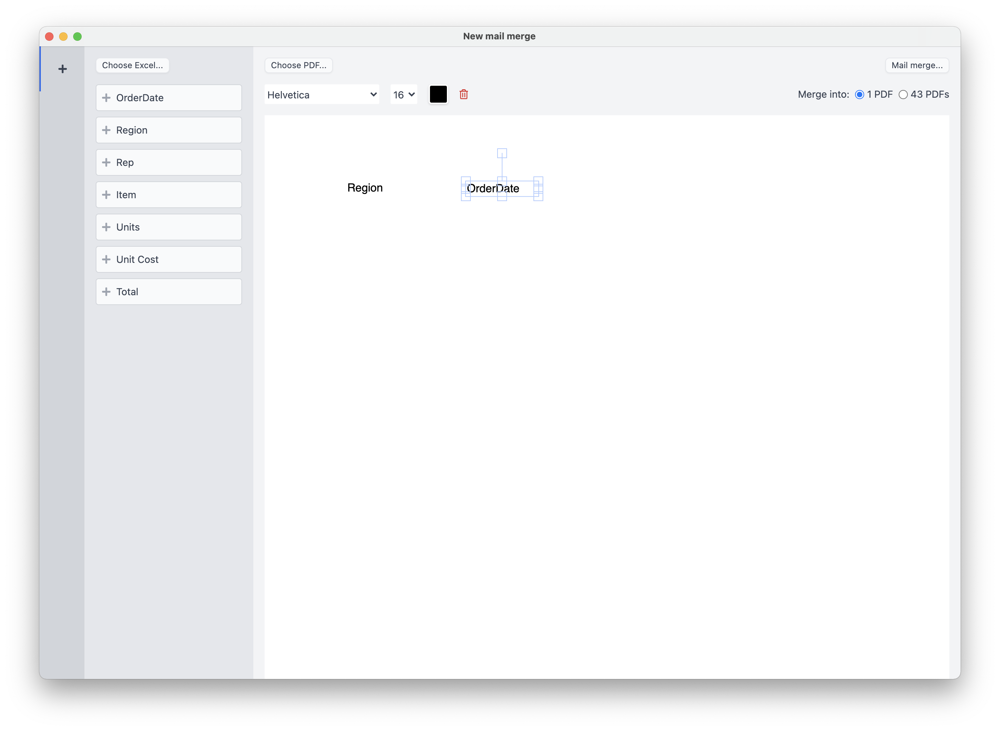

# PlainMerge - A PDF mail merger

_Disclaimer_: This repo contains outdated source code. The releases are always up to date.

## What is this?

Imagine you want to fill out a PDF form for 100 employees with a specific name and address
for each of them. You got the PDF form and all your staff information in an Excel file.

That's when PlainMerge helps.

After inputting an Excel file and a PDF file, you can drag and drop the Excel headers
into arbitrary positions or match them with native PDF form fields, and then PlainMerge
will generate multiple PDFs for you based on rows in the Excel file.

You got 100 different PDFs for each employee now.

## Features

- [x] Drag & drop fields to customize PDF template
- [x] Support native PDF forms
- [x] Support multiple-pages PDFs
- [x] Support rendering QR code using column data
- [x] Support custom fonts
- [x] Support `.xlsx`, `.xls` and `.ods` Excel file formats
- [x] Send out emails with PDF attachments
- [x] Cross-platform: macOS, Windows, Linux
- [x] Work offline

## Demo

## Try

Download page: https://github.com/plainlab/plainmerge/releases/latest

- macOS: Get `.dmg` file, open it and drag the app into Applications folder, for Apple
  Silicon mac: get `arm64.dmg` file instead.
- Windows: Get `.exe` file and open it to install.
- Linux: Get `.AppImage` file to install, for ARM laptop: get `arm64.AppImage` file instead.

## Buy

We believe in a transparent and fair world, so we open-source the app and
you get a trial version for your personal use, but if you find the app helpful,
please make a purchase.

### Multiple Platforms

- Purchase page: https://gum.co/plainmerge (accept Debit/Credit cards and PayPal).
- After purchasing, you will get a license key from Gumroad. Use that key to register the app.

One time fee. Multiple platforms: macOS, Windows, Linux

### Mac Store

One time fee. Only available on macOS.

---

&copy; 2023 Tai Vo
