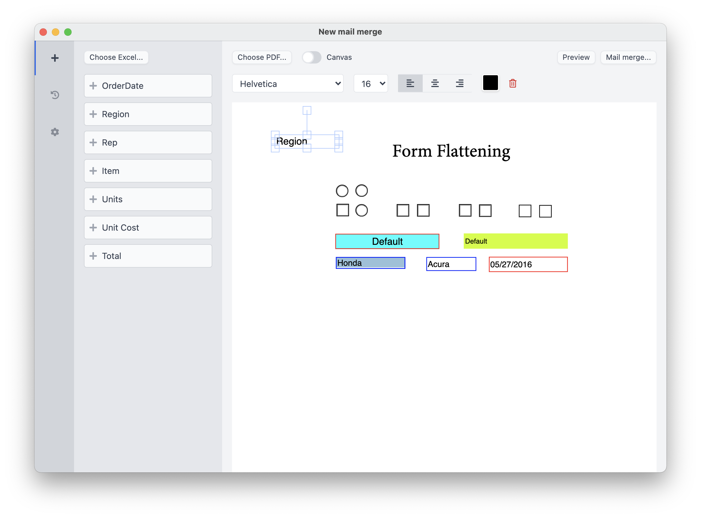

# PlainMerge

> An offline PDF mail merger

## Features

- Drag & drop fields to customize PDF template
- Support `.xlsx`, `.xls`, `.ods` Excel files
- Work offline
- Cross-platform

## Demo

## Try

For Windows, MacOS & Linux: https://github.com/plainlab/plainmerge/releases

## Buy

For Windows & MacOS: https://plainlab.gumroad.com/l/plainmerge

---

&copy; 2021 PlainLab
